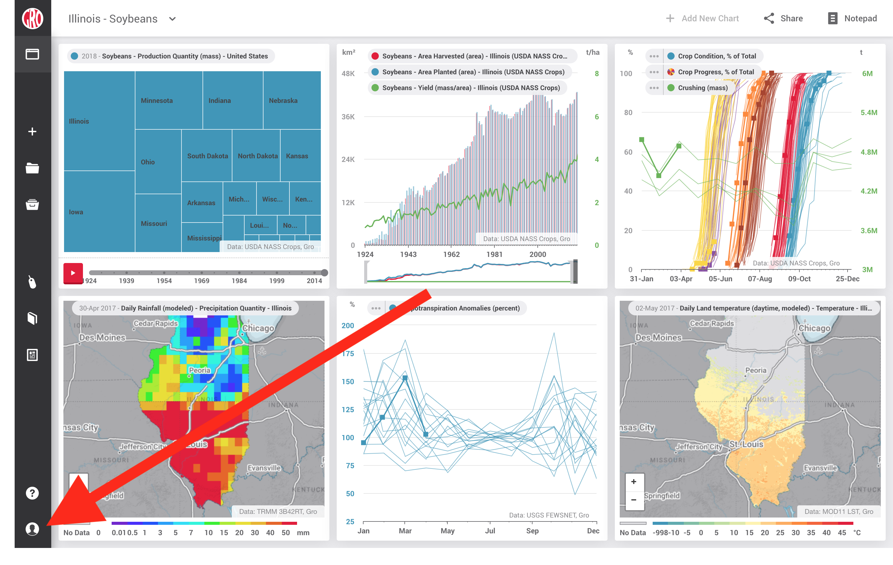
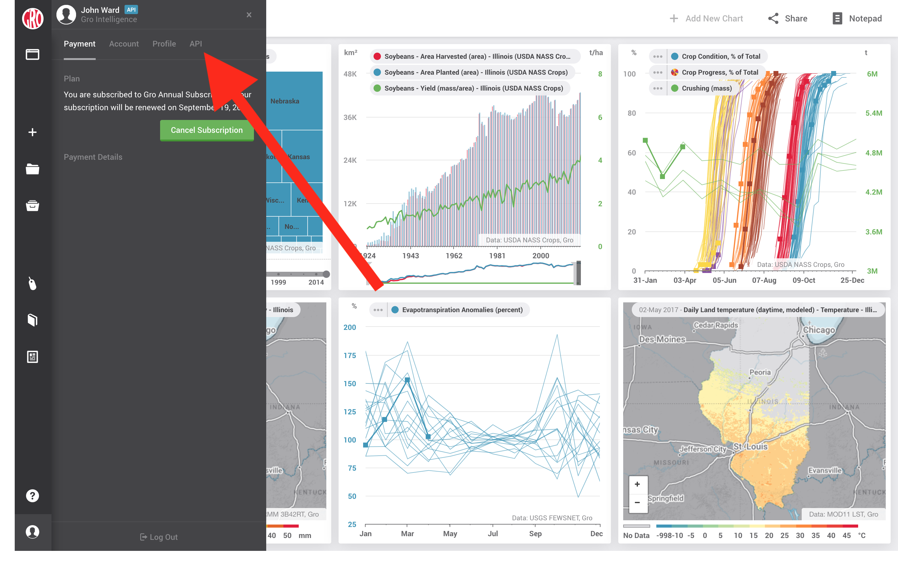
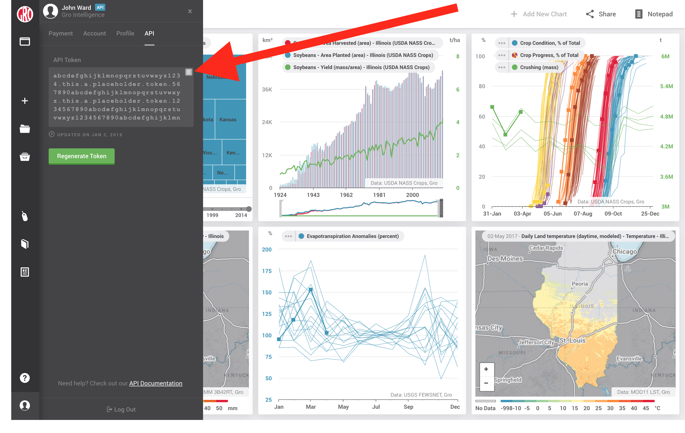
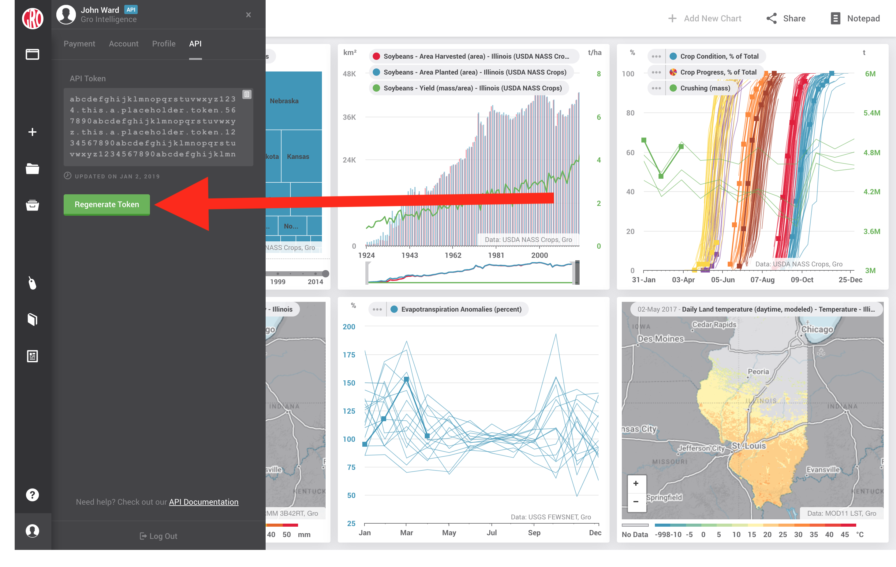

# Setting Up Your Environment
In order to start engaging with the Gro API Client, you will need to set up your local environment with some basic requirements.

[System Prerequisites](#SystemPrerequisites)
[Authentication Token/Saving Environment Variables](#Authentication)

# <a name="SystemPrerequisites"></a> System Prerequisites
The Gro API Client requires the following OS-dependant system requirements.

MacOS and Linux
1. git (Installation instructions)
2. python (2.7.x or 3.x) (2 Installation instructions / 3 Installation instructions)
3. pip (Installation instructions. Note "pip is already installed if you are using Python 2 >=2.7.9 or Python 3 >=3.4")

Windows
1. Powershell (should come default with Windows)
2. Python version >= 2.7.13 (available for download from python.org)
3. Install both Python and pip to PATH either in installer (enable component during the installation) or manually. The easiest way to do this is to make sure the below is checked during installation: readme_add_python_to_path_installer
4. Install Git from git-scm.com. Proceed with the default options.

## Python
The Gro API client is compatible with both Python 2.7.x and Python 3.x (3.6 and 3.7 are currently tested). 

## Installing Gro Packages
Now that you have downloaded the base system requirements, you will need to install the packages for the Gro API Client.

Install with pip install
```pip install git+https://github.com/gro-intelligence/api-client.git```


# <a name="Authentication"></a> Authentication Token/Saving Environment Variables
To work with the Gro API, you need an authentication token. This token needs to be sent along with every request made to the API. This is typically done by using one of the included Client classes (`Client`, `GroClient`, `BatchClient`, or `CropModel`): you provide your access token when creating the object, and then every API request made thereafter automatically includes the token. See the (MAKE LINK) sample scripts for examples.

[Retrieving a token](#Retrieval)
1. [Using the Web App](#RetrievalWebApp)
2. [Using the gro_client Command Line Interface](#RetrievalCLI)
3. [Using the get_access_token() Function](#RetrievalGAT)
[Expiring/Regenerating Tokens](#ExpiringTokens)
[Saving your token as an environment variable](#SavingEnvVar)

## <a name="Retrieval"></a> Retrieving a token
Note that your account needs to be activated for API access before you will be able to retrieve a token. See https://gro-intelligence.com/products/gro-api for more info regarding unlocking API access for your account.
Once you have API access enabled for your account, you may retrieve your token in any of the following ways:
1. Using the Gro Web Application (preferred)
2. Using the Gro Command Line Interface
3. Using the get_access_token() Function

### <a name="RetrievalWebApp"></a> Option 1: Using the Web App (Recommended)
1. Log in to your Gro account at http://app.gro-intelligence.com and open your Account menu using the button on the bottom left of the Gro dashboard (see image below).


2. In the Account menu, select the API tab (see below).


3. Select the text of the token and copy it to your clipboard, or use the "copy to clipboard" button (see below).


### <a name="RetrievalCLI"></a> Option 2: Using the gro_client Command Line Interface
Limitation: The Gro Command Line Interface cannot retrieve tokens for users using OAuth authentication. If this applies to you, please use the Gro web application instead.

When you install the Gro API Client via pip, the `gro_client` command line interface is automatically added to your PATH. This is a convenience tool for doing basic operations on the command line without needing to write a full Python script. One of its uses is it can retrieve your authentication token and print that token out to the console. To do so, execute the command below on your command line, substituting email@example.com for the email address associated with your Gro web application account:

```gro_client --user_email=email@example.com --print_token```

You should then be prompted for a password. Note that this password prompt does not display any user input on the command line, so it may appear as though you are not typing anything. This is intended. Simply type your password and press Enter.

If the password is accepted, your access token is printed to the console.

### <a name="RetrievalGAT"></a> Option 3: Using the `get_access_token()` Function

Limitation: The `get_access_token()` function cannot retrieve tokens for users using OAuth authentication. If this applies to you, please use the Gro web application instead.

If you would like to programmatically retrieve your active token, you may use the `get_access_token()` function in the API Client library. See below:

```from api.client.lib import get_access_token
API_HOST = 'api.gro-intelligence.com'
EMAIL = 'example@example.com'
PASSWORD = 'password123'
ACCESS_TOKEN = get_access_token(API_HOST, EMAIL, PASSWORD)
```

It is generally bad practice to put login credentials directly in code as in this example, but the `get_access_token()` function may be useful for productionization purposes, making the application more robust to tokens expiring (see the next section).

## <a name="ExpiringTokens"></a> Expiring/Regenerating Tokens
There are two ways you can invalidate your current authorization token and create a new one, both of which are performed through the Gro web application:
Changing your password, or
Using the "Regenerate Token" button in the API section of your Account menu (see instructions below)
If you have your authentication token saved, performing either of these two actions will cause any applications using the old token to cease being able to contact the Gro API. You will need to follow the instructions in Section 1 to retrieve your new token and update any such applications accordingly.
To regenerate your authentication token, open the API tab in your Account menu as in Section 1.1, but instead of copying the authentication token, press the "Regenerate Token" button (see below). A prompt will appear to warn that any applications using the old token will need to be updated and to confirm your intent.



## <a name="SavingEnvVar"></a>Saving your token as an environment variable
If you don't want to enter a password or token each time, you can save the token as an environment variable. Please consult your OS or IDE documentation for information on how to set environment variables, e.g. setting environment variables in Windows Powershell and Mac OS X/Linux. In some of the sample code, it is assumed that you have the token saved to your environment variables as `GROAPI_TOKEN`.
