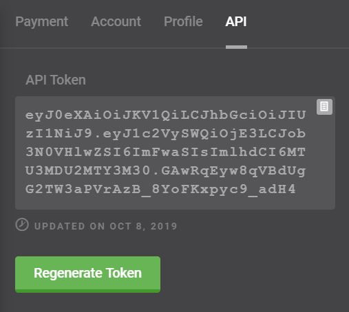
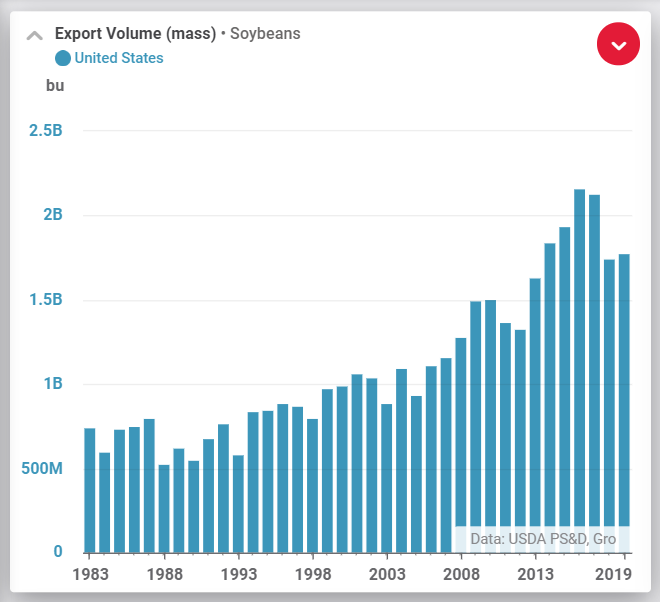
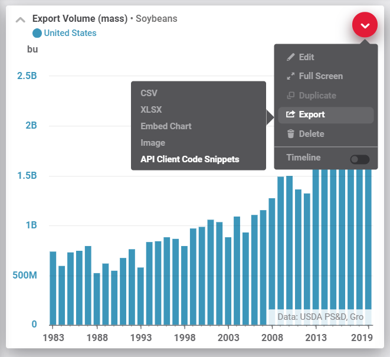
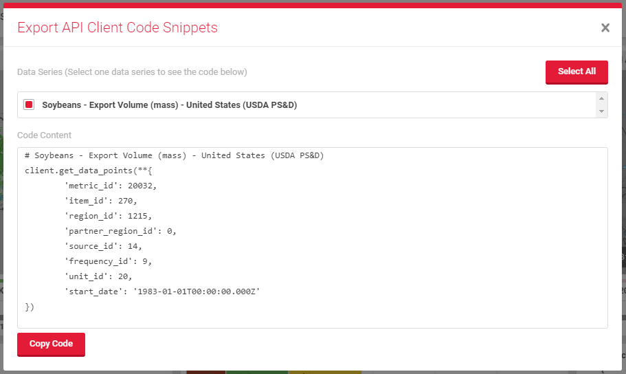

# Quickstart Examples

Now that you have installed the basic requirements, you can start pulling data. Try out the examples below, or navigate to the [api/client/samples/](https://github.com/gro-intelligence/api-client/blob/development/api/client/samples) folder for more options.

## Get Started in 120 Seconds

If you have a Google account, or if you already have [Jupyter Notebook](https://jupyter.readthedocs.io/en/latest/install.html) and python installed, and a Gro API token, you can start pulling Gro data via our API client within 120 seconds.

__Step 1: Get your API token__
1. Login to your Gro web app account at [app.gro-intelligence.com](app.gro-intelligence.com)
2. Open the Account button in the bottom left corner of the app.

3. Navigate to the API tab.

4. Copy your token.

__Step 2: Run the code in a notebook__
1. Navigate to [Google Colab](https://colab.research.google.com/), or launch Jupyter Notebook from your command line with the command `jupyter notebook`. 
2. Copy the below code and paste it into the first cell.
```
!pip install git+https://github.com/gro-intelligence/api-client.git
```
Then click the "Run Cell" button to the left of the cell.
In Colab, it will look like this:

In Jupyter Notebook, it looks like this:

3. Add another cell with the "+ Code" button, then copy the below code and paste it into the second cell.
```
from api.client.gro_client import GroClient

API_HOST = 'api.gro-intelligence.com'
ACCESS_TOKEN = 'YOUR_TOKEN'
client = GroClient(API_HOST, ACCESS_TOKEN)
```
Replace the text YOUR_TOKEN with the token you copied from step one. Then click the "Run Cell" button to the left of the cell.
4. Add one more cell with the "+ Code" button, then copy the below code and paste it into the third cell.
```
# Rice, milled - Area Harvested (area) - Kenya (USDA PS&D)
client.get_data_points(**{
	'metric_id': 570001, 
	'item_id': 392, 
	'region_id': 1107, 
	'source_id': 14, 
	'frequency_id': 9
})
```
Click the "Run Cell" button to the left of the cell, and that's it! You should now see the data in the response.

__Step 3: Bonus Round__
1. Go to the Gro [web app](app.gro-intelligence.com) and choose a chart that you like.
2. Click the dropdown arrow in the top right of the chart.

3. Click Export, and then click API Client Code Snippets.

4. Copy to code from the pop up window.

5. Add another cell with the "+ Code" button, then paste the code you just copied.
6. Click the "Run Cell" button to the left of the call. Congrats! You've just discovered data in the web app and then pulled it via the API client.


## Quickstart.py

[quick_start.py](https://github.com/gro-intelligence/api-client/blob/development/api/client/samples/quick_start.py) is a simple script that creates an authenticated `GroClient` object and uses the `get_data_series()` and `get_data_points()` methods to find Area Harvested series for Ukrainian Wheat from a variety of different sources, and outputs the time series points to a CSV file. You will likely want to revisit this script as a starting point for building your own scripts.

Note that the script assumes you have your authentication token set to a `GROAPI_TOKEN` environment variable ([see Saving your token as an environment variable](./authentication#saving-your-token-as-an-environment-variable). If you don't wish to use environment variables, you can modify the sample script to set `ACCESS_TOKEN` in some other way.

```sh
$ python quick_start.py
```

If the API client is installed and your authentication token is set, a CSV file called `gro_client_output.csv` should be created in the directory where the script was run.

## Brazil Soybeans

See the [Brazil Soybeans](https://github.com/gro-intelligence/api-client/blob/development/api/client/samples/crop_models) example in the crop models folder for a longer, more detailed demonstration of many of the API's capabilities in the form of a Jupyter notebook.

This notebook demonstrates the `CropModel` class and its `compute_crop_weighted_series()` method in action. In this example, NDVI ([normalized difference vegetation index](https://app.gro-intelligence.com/dictionary/items/321)) for provinces in Brazil is weighted against each province's historical soybean production to put the latest NDVI values into context. 

## gro_client tool

You can also use the included gro_client tool as a quick way to request a single data series right on the command line. Try the following:

```sh
gro_client --metric="Production Quantity mass" --item="Corn" --region="United States" --user_email="email@example.com"
```

The gro_client command line interface does a keyword search for the inputs and finds a random matching data series. It displays the data series it picked in the command line and writes the data points out to a file in the current directory called gro_client_output.csv. This tool is useful for simple queries, but anything more complex should be done using the Python packages.
