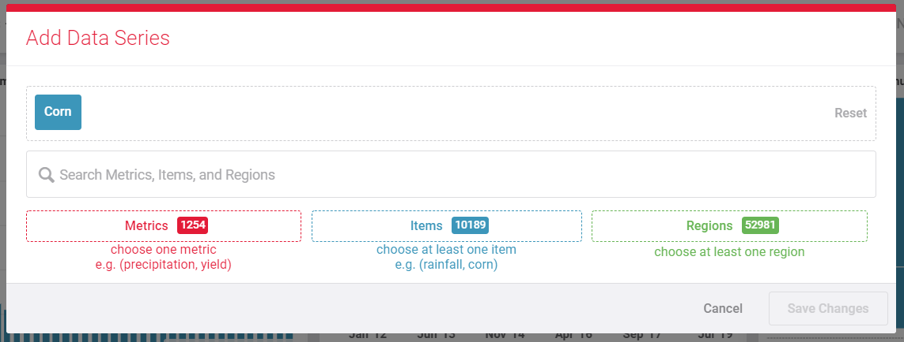
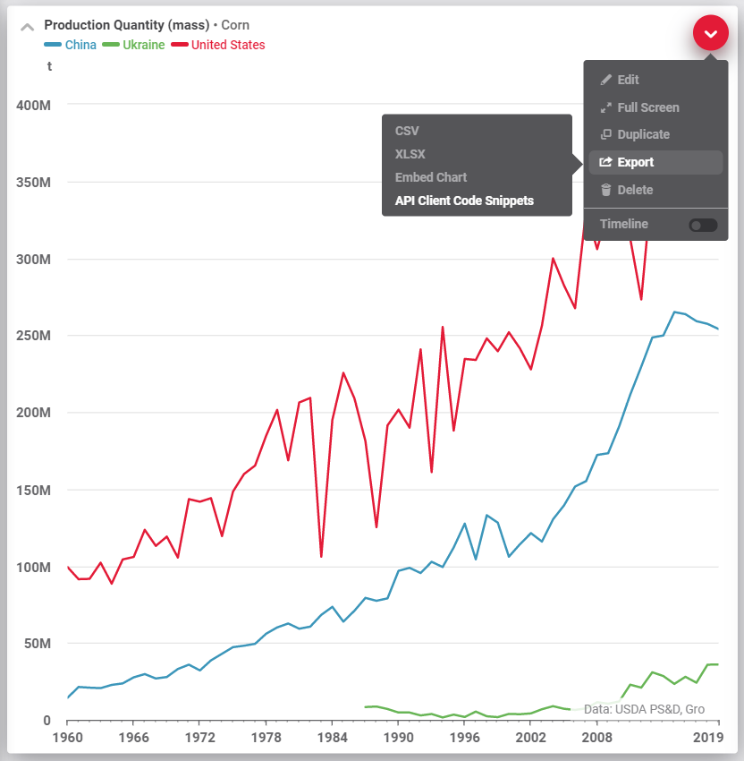
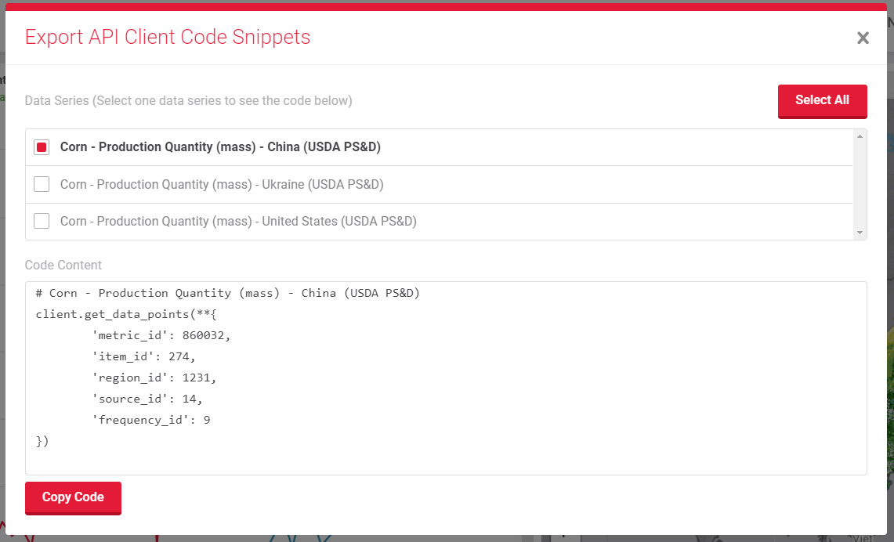
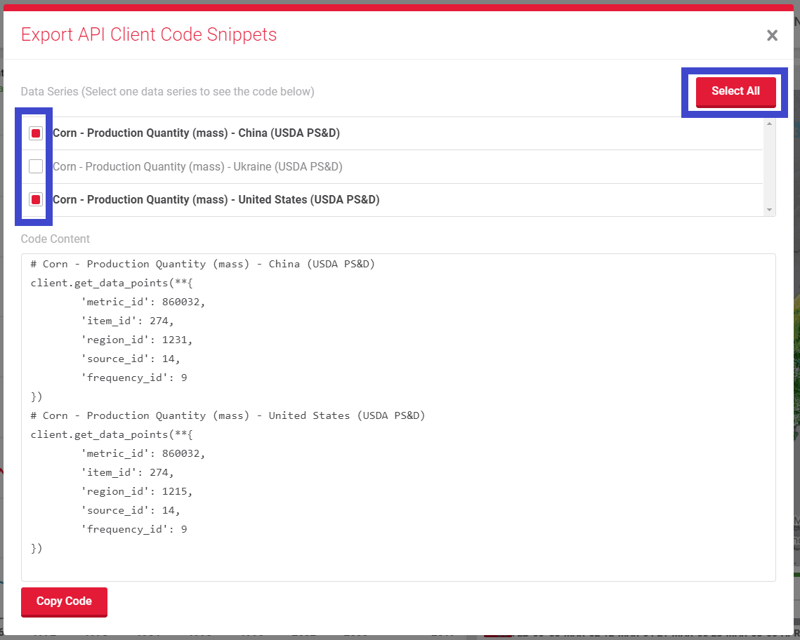

# Searching Data
To derive the insights you want from Gro's data, you will first want to find the data you're interested in. Below you will find some of the most useful tips on how to discover the data of greatest value to you.

## Code snippets
Users may find that the Gro API is at its most powerful when used in conjunction with the Gro web application. The web app provides the most convenient format for selecting the data series that is of most interest to you. In our Add Data Series window, you can select entities of interest, and then other entities for which no data is available based on your selection will be filtered out from the remaining options. For example, after selecting the item "Corn" only metrics and regions that have data for 'Corn' will remain selectable.


Once you have created a chart with data that you want, you can take advantage of our Code Snippets feature to pull that data into your API client code.

Simply click on the Chart Dropdown Button, then select Export and API Client Code Snippets. 


Every unique data series from your chart will now be available in a client.get_data_points function for easy copying and pasting into your code or command line.


For charts that have multiple data series, you have the option to Select all unique data series, or to select the individual series that are of greatest interest to you. 


## Search
As described in the [Data Series Definition](./data-series-definition.md) page, a data series in Gro is a unique combination of the entities: item, metric, region, partner_region (optional), frequency, and source. To find the specific entity you would like to retrieve data for, you can use a variety of search methods. For example, [`client.search()`](./api#api.client.gro_client.GroClient.search) will return a list of IDs that match your search term. If you want to understand the differences between various search results, you may find the [`client.search_and_lookup()`](./api#api.client.gro_client.GroClient.search_and_lookup) method more helpful.

`client.search_and_lookup('items','Corn')` will yield a list of all items that contain "corn" in their name, along with supporting information like id, name, and ids of other items contained by a given item.

Note: the above query will return a [generator](https://wiki.python.org/moin/Generators) object. Running a query like the one below will print every result: 
```py
for result in client.search_and_lookup('items','corn'): 
  print(result)
```

## Get data series
Instead of searching for all the individual entity IDs required to create a data series, the [`client.get_data_series()`](./api#api.client.gro_client.GroClient.get_data_series) method will return a list of all the data series available for the filters you have supplied. For example, if you are interested in Russian Oats you could use the following code to find out all the available data series that have "Oats" (item_id = 327) as the item and "Russia" (region_id = 1168) as the region:

```py
client.get_data_series(item_id=327, region_id=1168)
```

## Lookup contains
Our ontology is defined in terms of a graph, with metrics/items/regions containing others. In each case, you can see the `'contains'` property in the output of `client.lookup(type, id)`. For example:

```py
client.lookup('items', 10009)['contains'] 
```

will return a list of items ids for items that are cereals (item_id = 10009): `[..., 274, 422, ...]`. Once you have those ids, you can use the `client.lookup()` function on each one to find more info, like their names, e.g.: `client.lookup('items', 274)['name']` will return `Corn`.

Similarly, for regions, `client.lookup('regions', 1215)[contains]` will return a list of region ids for regions that are in the US (region_id = 1215): `[13100, 13061, 13053, 13099, ....]`. And each of those can be further looked up e.g. `client.lookup('regions', 13100)` will return `{'name': 'Wisconsin', 'level': 4, 'contains': [139839, 139857, 139863, ...]}`.

## Get descendants
Using the `lookup()` method, you can get an entity's list of direct children (i.e. country->provinces). However, you may want all of the lower level regions that belong to a higher level region (i.e. country->provinces, districts, coordinates, etc.). To do this, there's a helper function which also gives the option of filtering by region level: [`get_descendant_regions(region_id, descendant_level)`](./api#api.client.gro_client.GroClient.get_descendant_regions).

To look up all descendants of region 1029 (Brazil) that are of level 4 (provinces):
```py
from api.client.gro_client.GroClient import REGION_LEVELS
provinces_of_brazil = client.get_descendant_regions(1029, REGION_LEVELS['province'])
```
To look up all descendants of region 1029 (Brazil) that are of level 5 (districts): 

```py
from api.client.gro_client.GroClient import REGION_LEVELS
provinces_of_brazil = client.get_descendant_regions(1029, REGION_LEVELS['district'])
```
For more information on region levels, please refer to the [Special properties for regions](./gro-ontology#special-properties-for-regions) section of [Gro Ontology](./gro-ontology.html)

## Lookup belongs
If you want to find "what entities contain the given entity?" there is a method, [`client.lookup_belongs(type, child_id)`](./api#api.client.gro_client.GroClient.lookup_belongs) that does just that. For example:

```py
UNITED_STATES = 1215
client.lookup_belongs('regions', UNITED_STATES)
```
will yield `[{id: 15, name: 'North America', contains: [1215, 1037, ...], level: 2}, ...]`
